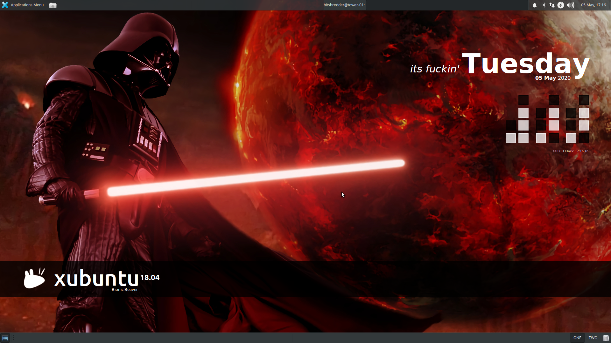

# KK Conky Scripts
A set of scripts for Conky, the system monitoring tool for X.

## Description
Conky provides desktop display of system monitoring; this package is a collection of scripts that provide graphical enhancements for your desktop. Each script can be configured seperately and one or
more can be run simultaneously.

**This package does not include Conky, it is only a collection of scripts that run with Conky. You must have Conky installed before these scripts will run.**

## Screenshot


## Configuration
Each **KK Conky Script** comes with a ``conkyrc`` file which can be tailored for your requirements. You are encouraged to play around with the settings in the ``conkyrc`` files, but it advised you do not edit
**Lua** scripts, unless you know what you are doing. For more information on ``conkyrc`` files, 


## Installation
#### Pre-requisits
If you want to run any of the **KK Conky Scripts** that use ``Lua`` you will need to check your **conky** installation.

````$ conky -v````

You will need to re-install **Conky** with the correct compilation flags if you do not see the following in your output

````
Lua bindings:
  * Cairo
  * Imlib2
````
The easiest way to achieve this is using the ``conky-all`` package. Details of how to install **Conky** on your system can be found at https://github.com/brndnmtthws/conky

#### Installer
KK Conky Scripts comes with a custom installer. Run the installer and choose which packages you want to install.

````$ sudo ./install.sh````

By default, all **KK Conky Script** files are installed under ``/home/$USER/.conky/``

An init script that willstart your chosen widgets will be written to ``/usr/local/bin/conky-init.sh`` and a **Desktop** file to ``/home/$USER/.config/autostart`` so that your **Conky** scripts are initialised at startup.